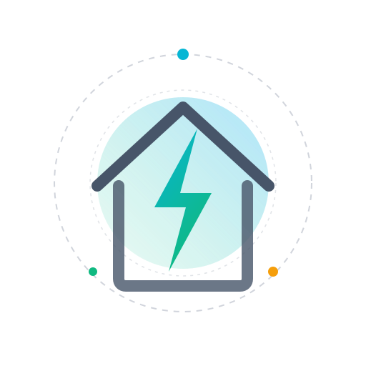

<p align="center">
  
</p>

# PEC SmartHub Integration for Home Assistant

[](https://github.com/hacs/integration)
[](manifest.json)
[](https://www.home-assistant.io)
[](LICENSE)

A custom, premium Home Assistant integration for **Pedernales Electric Cooperative (PEC) SmartHub** providing full utility tracking directly in your smart home. 

This integration is completely REST-based (requiring no heavy browser or Playwright environments) and is optimized for low resource usage. It features standard config flows, daily auto-updating coordinates, rolling consumption/cost trackers, daily temperature correlation statistics, and native Home Assistant Energy Panel integration via retroactive Green Button (ESPI XML) unzipping and injection.

---

## Key Features

* **Real-time Account Balances:** Instantly view `sensor.pec_balance_due` alongside due dates and auto-pay enrollments.
* **Rolling Daily Calculations:** Includes high-fidelity sensor structures for:
  * Rolling 7-day and 30-day completed electricity usage (kWh).
  * Rolling 7-day and 30-day completed cost estimations ($).
  * Latest finalized peak daily demand (kW) with exact timestamps.
* **Weather & Temp Correlation:** Leverages daily temperature records directly from PEC SmartHub weather indexes to track usage against weather changes.
* **Native Energy Panel Integration:** Automatically downloads the official ESPI Green Button data zip daily, unzips/parses the high-resolution 15-minute intervals, and injects historical statistics retroactively into the Home Assistant Recorder database!
* **Robust Session Management:** Leverages async REST logins, caching, and auto-reauth when JWT bearer tokens expire (5-minute window).
* **UI Config Flow:** Zero YAML configuration required. Simply log in with your standard PEC SmartHub username & password.

---

## Visual Preview & Dashboard Recipes

Create premium, interactive dashboard widgets using [apexcharts-card](https://github.com/RomRider/apexcharts-card) to visualize your energy profile.

### 1. 30-Day Completed Usage & Weather Correlation

This card visualizes your completed daily electricity usage (bars) mapped against the daily average temperature (line) to highlight heating/cooling correlation.

```yaml
type: custom:apexcharts-card
header:
  show: true
  title: 30-Day Usage vs. Average Temperature
  show_states: true
  colorize_states: true
graph_span: 30d
span:
  end: day
series:
  - entity: sensor.pec_last_30_completed_days_usage
    name: Daily Electricity Usage
    type: column
    color: '#3498db'
    data_generator: |
      return entity.attributes.completed_days.map(day => {
        return [new Date(day.date).getTime(), day.usage_kwh];
      });
  - entity: sensor.pec_last_30_completed_days_usage
    name: Avg Temperature (°F)
    type: line
    color: '#e74c3c'
    y_axis: 2
    stroke_width: 3
    data_generator: |
      return entity.attributes.completed_days.map(day => {
        return [new Date(day.date).getTime(), day.average_temp_f];
      });
yaxis:
  - id: 1
    decimals: 1
    apex_config:
      title:
        text: Usage (kWh)
  - id: 2
    opposite: true
    decimals: 0
    apex_config:
      title:
        text: Temp (°F)
```

### 2. 7-Day Costs & Daily Peak Demand

Visualize your daily electric costs for the last week along with your daily peak demand to monitor demand spikes.

```yaml
type: custom:apexcharts-card
header:
  show: true
  title: 7-Day Electricity Cost & Peak Demand
  show_states: true
  colorize_states: true
graph_span: 7d
span:
  end: day
series:
  - entity: sensor.pec_last_7_completed_days_cost
    name: Daily Cost ($)
    type: column
    color: '#2ecc71'
    data_generator: |
      return entity.attributes.completed_days.map(day => {
        return [new Date(day.date).getTime(), day.cost_usd];
      });
  - entity: sensor.pec_last_7_completed_days_usage
    name: Peak Demand (kW)
    type: line
    color: '#f39c12'
    y_axis: 2
    stroke_width: 3
    data_generator: |
      return entity.attributes.completed_days.map(day => {
        return [new Date(day.date).getTime(), day.peak_demand_kw];
      });
yaxis:
  - id: 1
    decimals: 2
    apex_config:
      title:
        text: Cost ($)
  - id: 2
    opposite: true
    decimals: 1
    apex_config:
      title:
        text: Demand (kW)
```

---

## Installation

### Method 1: HACS (Recommended)

1. Open **HACS** in your Home Assistant panel.
2. Click the three dots in the top-right corner and select **Custom repositories**.
3. Enter the URL of this repository: `https://github.com/bendavis/pec-smarthub-homeassistant` and select **Integration** as the category.
4. Click **Add**. The integration will appear in your HACS list.
5. Click **Download**, then restart Home Assistant.

### Method 2: Manual Installation

1. Download the latest release `.zip` or clone the repository.
2. Copy the directory `custom_components/pec_smarthub` into your Home Assistant config directory's `custom_components/` folder (so the path looks like `config/custom_components/pec_smarthub/`).
3. Restart Home Assistant.

---

## Setup & Configuration

1. In Home Assistant, navigate to **Settings** -> **Devices & Services**.
2. Click **+ Add Integration** in the bottom-right corner.
3. Search for **PEC SmartHub** and select it.
4. Enter your PEC SmartHub login credentials:
   * **Username / Email:** The email address you use to log in to PEC SmartHub.
   * **Password:** The password associated with your account.
5. Click **Submit**. The integration will authenticate with the server and automatically discover your primary account and service location.

---

## Sensor Entities Reference

The integration exposes 7 key sensor entities with high-fidelity attributes:

| Entity Name | Description | Key Attributes |
|---|---|---|
| `sensor.pec_latest_data_date` | The date of the most recently completed day of usage. | None |
| `sensor.pec_balance_due` | The total outstanding balance on your billing account. | `due_date`, `hours_until_due`, `autopay_enabled`, `last_payment_amount`, `last_payment_on` |
| `sensor.pec_latest_finalized_daily_peak_demand` | The highest peak demand recorded in the latest billing period (kW). | `peak_time` |
| `sensor.pec_last_7_completed_days_usage` | Total electric consumption for the last 7 completed days (kWh). | `completed_days` (JSON Array) |
| `sensor.pec_last_30_completed_days_usage` | Total electric consumption for the last 30 completed days (kWh). | `completed_days` (JSON Array) |
| `sensor.pec_last_7_completed_days_cost` | Estimated utility cost for the last 7 completed days ($). | `completed_days` (JSON Array) |
| `sensor.pec_last_30_completed_days_cost` | Estimated utility cost for the last 30 completed days ($). | `completed_days` (JSON Array) |

### The `completed_days` Attribute

To prevent historical usage data from being erased during standard Home Assistant database purges, the rolling usage and cost sensors contain a rich, structured `completed_days` JSON array. This is a collection of the last 30 days of usage, cost, demand, and temperature data:

```json
[
  {
    "date": "2026-05-21",
    "usage_kwh": 95.42,
    "cost_usd": 10.50,
    "peak_demand_kw": 15.90,
    "average_temp_f": 72.50,
    "timestamp_ms": 1779400800000
  },
  ...
]
```

This array is extremely powerful and can be used in Lovelace templates or ApexCharts scripts to display historical data long after Home Assistant purges individual sensor states.

---

## Home Assistant Energy Panel Integration

This integration downloads official high-resolution **Green Button data** in ESPI XML format representing your actual utility-meter intervals. 

During the nightly run (scheduled for 2:00 AM local time), the integration will:
1. Retrieve the zipped XML file from the PEC server.
2. Unzip and extract individual 15-minute consumption readings.
3. Retroactively inject these high-resolution electricity statistics into the Home Assistant Recorder database!

To add this data to your standard **Home Assistant Energy Dashboard**:
1. Go to **Settings** -> **Dashboards** -> **Energy**.
2. Click **Add Consumption** under **Electricity grid**.
3. Choose `sensor.pec_last_30_completed_days_usage` as your Grid consumption sensor (or the integrated historical statistics object).
4. Select **Use static price** or **Use an entity tracking physical cost** pointing to `sensor.pec_last_30_completed_days_cost`.
5. Save. It may take up to 2 hours for Home Assistant to rebuild and display historical statistics in the Energy graphs.

---

## Troubleshooting & Debugging

If you encounter any issues, enable debug logs for this integration by adding the following to your `configuration.yaml` file:

```yaml
logger:
  default: info
  logs:
    custom_components.pec_smarthub: debug
```

Restart Home Assistant to apply the logging level. Logs will be written to the standard `home-assistant.log` file.

---

## Developer Info & Standard Tests

Running tests is simple and requires no network requests since all services are completely mocked using `aresponses`:

```bash
# Create and activate virtual environment
python3 -m venv venv
source venv/bin/activate

# Install requirements
pip install -r requirements_test.txt
pip install -e .

# Run the comprehensive test suite
PYTHONPATH=. pytest tests/
```

---

## License

This project is licensed under the MIT License. See [LICENSE](LICENSE) for details.
